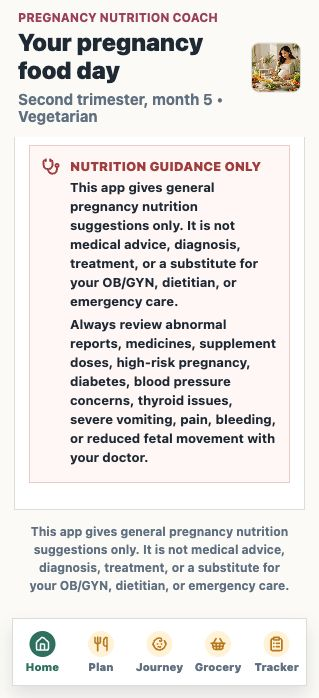
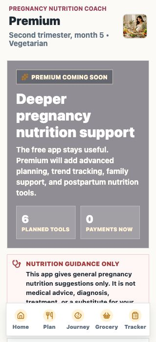

# Pregnancy Nutrition Coach

Cross-platform iOS and Android pregnancy nutrition coaching app built with Expo and React Native.

Expo React Native pregnancy nutrition coach with meal planning, symptom support, and privacy-first local tracking.

## Screenshots

| Home dashboard | Premium roadmap |
| --- | --- |
|  |  |

## Current Status

- Product prototype is ready for public GitHub visibility and portfolio pinning.
- Android and iOS Expo export smoke tests are configured through `npm run export:android` and `npm run export:ios`.
- Store documentation drafts are included for Play Store listing, App Store submission, privacy policy, and production readiness.
- Premium is shown as a coming-soon roadmap only. No subscription, payment, or purchase is enabled in this build.
- Before a real store launch, replace placeholder business/contact details, host the privacy policy on a public HTTPS URL, test on real devices, and create signed EAS production builds.

## Medical Boundary

This app gives general pregnancy nutrition suggestions only. It is not medical advice, diagnosis, treatment, or a substitute for an OB/GYN, dietitian, or emergency care. Abnormal reports, medicines, supplement doses, scans, high-risk pregnancy decisions, diabetes, blood pressure concerns, thyroid issues, severe vomiting, bleeding, pain, or reduced fetal movement must be reviewed with a doctor.

## Features

- Profile personalization by age, height, pre-pregnancy weight, current weight, pregnancy month, due date, pregnancy count, baby count, activity, allergies, and cuisine.
- Visual home dashboard with pregnancy nutrition hero image, quick actions, and bottom navigation.
- Multi-step onboarding for welcome, safety, profile, diet, and optional reports.
- Diet categories: vegetarian, non-vegetarian, eggetarian, and vegan.
- Lab-aware guidance for hemoglobin, ferritin, vitamin B12, vitamin D, glucose, blood pressure, gestational diabetes, thyroid disorder, and severe nausea.
- BMI and pregnancy weight-gain range calculation.
- Month-wise nutrition focus from month 1 to month 9.
- Full-day meal plan with substitutions.
- Meal swap controls for alternate breakfast, lunch, snack, dinner, and bedtime ideas.
- Month-wise pregnancy journey with baby growth, mother focus, and preparation prompts.
- Auto grocery list by diet category.
- Symptom manager for nausea, acidity, constipation, swelling, and cravings.
- Daily checklist for hydration, protein, iron, calcium, fruits, vegetables, prenatal supplement reminder, and movement.
- 7-day checklist history.
- Settings area for profile, reports, symptoms, premium, and local data reset.
- Safety alerts and doctor-review boundaries.
- Premium coming-soon screen with roadmap cards, pricing prototype, and clear note that no subscription or payment is enabled.

## GitHub Repo Metadata

Suggested repo description:

```text
Expo React Native pregnancy nutrition coach with meal planning, symptom support, and privacy-first local tracking.
```

Suggested topics:

```text
expo, react-native, pregnancy, nutrition, meal-planning, health-tech, womens-health, mobile-app, privacy-first
```

## Run

```sh
npm install
npm run generate-assets
npm start
```

Then:

- Press `i` for iOS simulator.
- Press `a` for Android emulator.
- Scan the QR code with Expo Go on a physical device.

## Production Build

Install and log in to EAS CLI, then create an Android App Bundle for Play Store upload:

```sh
npm run generate-assets
npx eas login
npm run build:android
```

The Play Store requires a privacy policy URL, store listing, screenshots, content rating, data safety form, app signing, and review submission through Google Play Console.

See [free-premium-project-prototype.md](free-premium-project-prototype.md) for the product split between free and premium features.

See [android-ios-product-build.md](android-ios-product-build.md) for Android and iOS product build steps.

See [app-store-submission.md](app-store-submission.md) for App Store Connect metadata, privacy label draft, and iOS submission steps.
